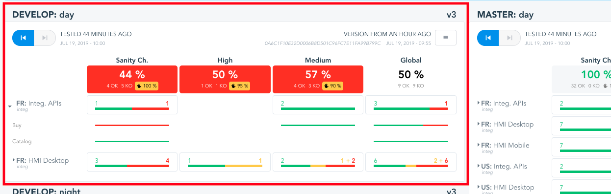
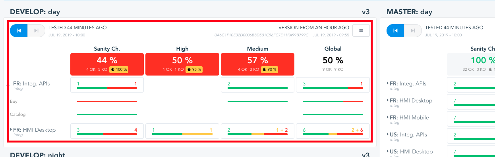
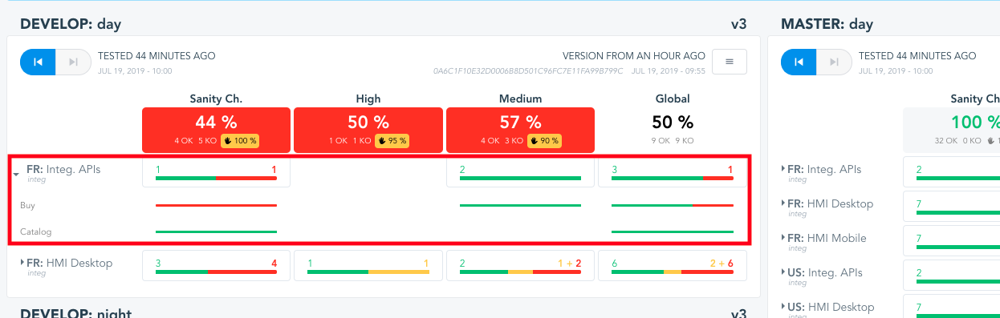
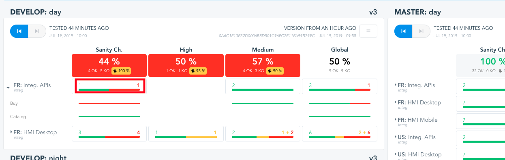

# How ARA works

To understand how to upload reports on ARA, it's highly recommanded to read this part and learn how ARA works
internally.

## The Data model of ARA

ARA use a very basic data model internally :

### The Cycle

The Cycle represents a scheduled test execution on a given *Branch* (a VCS branch like a Git branch for example),
for a given *project*

For example, in the image bellow, the cycle `Day` represents all the executions on Develop for the Demo project
(here in red) :



A Cycle can be linked to several Executions.

### The Execution

The Execution represents the grouping of tests for different *test types* and *countries*.

For example, an execution may contains the reports of all the Cucumber and Postman tests for a french
environment on build X of the project.
In the image bellow, the red part is the execution :



An Execution may be composed of several Runs.

### The Run

The Run represents the execution of *one Test type* for *one given country* in an execution.

In the example bellow, we have two runs : `FR: Integ. APIs` and `FR: HMI Desktop` :



A Run may be composed of several Executed Scenario.

### The Executed Scenario

The Executed Scenario represent the execution of *One test Scenario* (either a Postman collection or a Cucumber
scenario for example).

In the image bellow, for one run, we have one Executed Scenario passing and one Executed Scenario failing :




## The Informations files of ARA

In order to work and to know what and how to analyse, ARA will need some specific files in each reports you'll
upload.

### The cycleDefinition.json

This file will describe how the given execution reports should be treated. It needs to be added at the root of
the ZIP file send to ARA to explain to the system how to rattach the reports with the teams/problems/thresholds...

It describes what the execution is *expected* to run.

Some jobs in the execution can fail to start or be skipped due to earlier failures.
With the `cycleDefinition.json` file, ARA is shielded from such missing data.

If one of the sub-jobs did not run, ARA will show a failed execution because of missing results, instead of
showing a succeed execution because no test failed.

Here is an example of one `cycleDefinition.json` file:
```json
{
  "blockingValidation": true,
  "platforms_rules": {
    "integ2": [
      {
        "blockingValidation": true,
        "country": "FR",
        "countryTags": "all,nl",
        "testTypes": "api,api-postman,firefox",
        "severityTags": "all",
        "enabled": false
      }
    ]
  },
  "qualityThresholds": {
    "high": {
      "failure": 85,
      "warning": 90
    },
    "sanity-check": {
      "failure": 90,
      "warning": 95
    },
    "medium": {
      "failure": 80,
      "warning": 85
    }
  }
}
```

In the first line of this json (`blockingValidation`), we tells to ARA that if the given quality Threshold are
not met, then a call to the API `{ara_baseurl}/api/projects/{projectCode}/executions/quality-status?jobUrl={jobUrl}`
will return `FAILED`.

The `platforms_rules` block define what to analyze or not for the given platforms (Your free to define your platform's
name -- here `integ2` -- it will be added to each run of your execution).

For each platformRule, we define if this platform should respect the threshold (`blockingValidation` - note that this
parameter may be overrided by the global one), on what country does it run (`Country`), and what are the country tags to
(`countryTags`), the test types (`testTypes`) and severities (`severityTags`) to analyze in the given report files. Those
parameters must match the values you set in your project's settings.

The `enabled` param is an easy way to disabled the ARA analyze for a given platform without deleting your configuration.


The `qualityThresholds` block define what are the threshold to use for each severities used in your project. If the
quality status of a severity for this execution is bellow the `warning` one, a call to the `quality-status` API will
return `WARNING`. If it's bellow the `failure` one, it will return `FAILED`.


### The buildDefinition.json